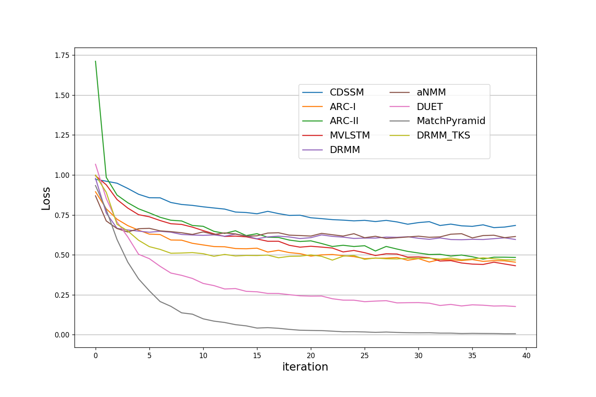

<div align='center'>

</div>

---
MatchZoo is a toolkit for text matching. It was developed with a focus on facilitating the designing, comparing and sharing of deep text matching models. There are a number of deep matching methods, such as DRMM, MatchPyramid, MV-LSTM, aNMM, DUET, ARC-I, ARC-II, DSSM, and CDSSM, designed with a unified interface. Potential tasks related to MatchZoo include document retrieval, question answering, conversational response ranking, paraphrase identification, etc. We are always happy to receive any code contributions, suggestions, comments from all our MatchZoo users.

<table>
  <tr>
    <th width=30%, bgcolor=#999999 >Tasks</th> 
    <th width=20%, bgcolor=#999999>Text 1</th>
    <th width="20%", bgcolor=#999999>Text 2</th>
    <th width="20%", bgcolor=#999999>Objective</th>
  </tr>
  <tr>
    <td align="center", bgcolor=#eeeeee> Paraphrase Indentification </td>
    <td align="center", bgcolor=#eeeeee> string 1 </td>
    <td align="center", bgcolor=#eeeeee> string 2 </td>
    <td align="center", bgcolor=#eeeeee> classification </td>
  </tr>
  <tr>
    <td align="center", bgcolor=#eeeeee> Textual Entailment </td>
    <td align="center", bgcolor=#eeeeee> text </td>
    <td align="center", bgcolor=#eeeeee> hypothesis </td>
    <td align="center", bgcolor=#eeeeee> classification </td>
  </tr>
  <tr>
    <td align="center", bgcolor=#eeeeee> Question Answer </td>
    <td align="center", bgcolor=#eeeeee> question </td>
    <td align="center", bgcolor=#eeeeee> answer </td>
    <td align="center", bgcolor=#eeeeee> classification/ranking </td>
  </tr>
  <tr>
    <td align="center", bgcolor=#eeeeee> Conversation </td>
    <td align="center", bgcolor=#eeeeee> dialog </td>
    <td align="center", bgcolor=#eeeeee> response </td>
    <td align="center", bgcolor=#eeeeee> classification/ranking </td>
  </tr>
  <tr>
    <td align="center", bgcolor=#eeeeee> Information Retrieval </td>
    <td align="center", bgcolor=#eeeeee> query </td>
    <td align="center", bgcolor=#eeeeee> document </td>
    <td align="center", bgcolor=#eeeeee> ranking </td>
  </tr>
</table>

## Installation
MatchZoo is still under development. Before the first stable release (1.0), please clone the repository and run
```
git clone https://github.com/faneshion/MatchZoo.git
cd MatchZoo
python setup.py install
```
In the main directory, this will install the dependencies automatically.

For usage examples, you can run
```
python matchzoo/main.py --phase train --model_file examples/toy_example/config/arci_ranking.config
python matchzoo/main.py --phase predict --model_file examples/toy_example/config/arci_ranking.config
```

## Overview
The architecture of the MatchZoo toolkit is described in the Figure  in what follows,
<div align='center'>

</div>
There are three major modules in the toolkit, namely data preparation, model construction, training and evaluation, respectively. These three modules are actually organized as a pipeline of data flow.

### Data Preparation
The data preparation module aims to convert dataset of different text matching tasks into a unified format as the input of deep matching models. Users provide datasets which contains pairs of texts along with their labels, and the module produces the following files.

+	**Word Dictionary**: records the mapping from each word to a unique identifier called *wid*. Words that are too frequent (e.g. stopwords), too rare or noisy (e.g. fax numbers) can be  filtered out by predefined rules.
+	**Corpus File**: records the mapping from each text to a unique identifier called *tid*, along with a sequence of word identifiers contained in that text. Note here each text is truncated or padded to a fixed length customized by users.
+	**Relation File**: is used to store the relationship between two texts, each line containing a pair of *tids* and the corresponding label.
+   **Detailed Input Data Format**: a detailed explaination of input data format can be found in MatchZoo/data/example/readme.md.

### Model Construction
In the model construction module, we employ Keras library to help users build the deep matching model layer by layer conveniently. The Keras libarary provides a set of common layers widely used in neural models, such as convolutional layer, pooling layer, dense layer and so on. To further facilitate the construction of deep text matching models, we extend the Keras library to provide some layer interfaces specifically designed for text matching.

Moreover, the toolkit has implemented two schools of representative deep text matching models, namely representation-focused models and interaction-focused models [[Guo et al.]](http://www.bigdatalab.ac.cn/~gjf/papers/2016/CIKM2016a_guo.pdf).

### Training and Evaluation
For learning the deep matching models, the toolkit provides a variety of objective functions for regression, classification and ranking. For example, the ranking-related objective functions include several well-known pointwise, pairwise and listwise losses. It is flexible for users to pick up different objective functions in the training phase for optimization. Once a model has been trained, the toolkit could be used to produce a matching score, predict a matching label, or rank target texts (e.g., a document) against an input text.

## Benchmark Results:
Here, we adopt <a href="https://www.microsoft.com/en-us/download/details.aspx?id=52419">WikiQA</a> dataset for an example to inllustrate the usage of MatchZoo. WikiQA is a popular benchmark dataset for answer sentence selection in question answering. We have provided <a href="./data/WikiQA/run_data.sh">a script</a> to download the dataset, and prepared it into the MatchZoo data format. In the <a href="">models directory</a>, there are a number of configurations about each model for WikiQA dataset. 

Take the DRMM as an example. In training phase, you can run
```
python matchzoo/main.py --phase train --model_file examples/wikiqa/config/drmm_wikiqa.config
```
In testing phase, you can run
```
python matchzoo/main.py --phase predict --model_file examples/wikiqa/config/drmm_wikiqa.config
```

We have compared 10 models, the results are as follows.
<table>
  <tr>
    <th width=10%, bgcolor=#999999 >Models</th> 
    <th width=20%, bgcolor=#999999>NDCG@3</th>
    <th width="20%", bgcolor=#999999>NDCG@5</th>
    <th width="20%", bgcolor=#999999>MAP</th>
  </tr>
  <tr>
    <td align="center", bgcolor=#eeeeee> DSSM </td>
    <td align="center", bgcolor=#eeeeee> 0.5439 </td>
    <td align="center", bgcolor=#eeeeee> 0.6134 </td>
    <td align="center", bgcolor=#eeeeee> 0.5647 </td>
  </tr>
  <tr>
  	 <td align="center", bgcolor=#eeeeee> CDSSM </td>
  	 <td align="center", bgcolor=#eeeeee> 0.5489 </td>
  	 <td align="center", bgcolor=#eeeeee> 0.6084</td>
  	 <td align="center", bgcolor=#eeeeee> 0.5593 </td>
  </tr>
  <tr>
  	 <td align="center", bgcolor=#eeeeee> ARC-I </td>
  	 <td align="center", bgcolor=#eeeeee> 0.5680 </td>
  	 <td align="center", bgcolor=#eeeeee> 0.6317 </td>
  	 <td align="center", bgcolor=#eeeeee> 0.5870 </td>
  </tr>
  <tr>
  	 <td align="center", bgcolor=#eeeeee> ARC-II </td>
  	 <td align="center", bgcolor=#eeeeee> 0.5647 </td>
  	 <td align="center", bgcolor=#eeeeee> 0.6176 </td>
  	 <td align="center", bgcolor=#eeeeee> 0.5845 </td>
  </tr>
  <tr>
  	 <td align="center", bgcolor=#eeeeee> MV-LSTM </td>
  	 <td align="center", bgcolor=#eeeeee> 0.5818 </td>
  	 <td align="center", bgcolor=#eeeeee> 0.6452 </td>
  	 <td align="center", bgcolor=#eeeeee> 0.5988 </td>
  </tr>
  <tr>
  	 <td align="center", bgcolor=#eeeeee> DRMM </td>
  	 <td align="center", bgcolor=#eeeeee> 0.6107 </td>
  	 <td align="center", bgcolor=#eeeeee> 0.6621 </td>
  	 <td align="center", bgcolor=#eeeeee> 0.6195 </td>
  </tr>
  <tr>
     <td align="center", bgcolor=#eeeeee> aNMM </td>
     <td align="center", bgcolor=#eeeeee> 0.6160 </td>
     <td align="center", bgcolor=#eeeeee> 0.6696 </td>
     <td align="center", bgcolor=#eeeeee> 0.6297 </td>
  </tr>
  <tr>
  	 <td align="center", bgcolor=#eeeeee> DUET </td>
  	 <td align="center", bgcolor=#eeeeee> 0.6065 </td>
  	 <td align="center", bgcolor=#eeeeee> 0.6722 </td>
  	 <td align="center", bgcolor=#eeeeee> 0.6301 </td>
  </tr>
  <tr>
  	 <td align="center", bgcolor=#eeeeee> MatchPyramid </td>
  	 <td align="center", bgcolor=#eeeeee> 0.6317 </td>
  	 <td align="center", bgcolor=#eeeeee> 0.6913 </td>
  	 <td align="center", bgcolor=#eeeeee> 0.6434 </td>
  </tr>
  <tr>
  	 <td align="center", bgcolor=#eeeeee> DRMM_TKS </td>
  	 <td align="center", bgcolor=#eeeeee> 0.6458 </td>
  	 <td align="center", bgcolor=#eeeeee> 0.6956 </td>
  	 <td align="center", bgcolor=#eeeeee> 0.6586 </td>
  </tr>
 
</table>
The loss of each models are described in the following figure,
 <div align='center'>

</div>

The MAP of each models are depicted in the following figure,
<div align='center'>

</div>
Here, the DRMM_TKS is a variant of DRMM for short text matching. Specifically, the matching histogram is replaced by a top-k maxpooling layer and the remaining part are fixed. 

## Model Detail:

1. DRMM

this model is an implementation of <a href="http://www.bigdatalab.ac.cn/~gjf/papers/2016/CIKM2016a_guo.pdf">A Deep Relevance Matching Model for Ad-hoc Retrieval</a>.

- model file: models/drmm.py
- model config: models/drmm_ranking.config

---
2. MatchPyramid

this model is an implementation of <a href="https://arxiv.org/abs/1602.06359"> Text Matching as Image Recognition</a>

- model file: models/matchpyramid.py
- model config: models/matchpyramid_ranking.config

---
3. ARC-I

this model is an implementation of <a href="https://arxiv.org/abs/1503.03244">Convolutional Neural Network Architectures for Matching Natural Language Sentences</a>

- model file: models/arci.py
- model config: models/arci_ranking.config

---
4. DSSM

this model is an implementation of <a href="https://www.microsoft.com/en-us/research/wp-content/uploads/2016/02/cikm2013_DSSM_fullversion.pdf">Learning Deep Structured Semantic Models for Web Search using Clickthrough Data</a>

- model file: models/dssm.py
- model config: models/dssm_ranking.config

---
5. CDSSM

this model is an implementation of <a href="https://www.microsoft.com/en-us/research/publication/learning-semantic-representations-using-convolutional-neural-networks-for-web-search/">Learning Semantic Representations Using Convolutional Neural Networks for Web Search</a>

- model file: models/cdssm.py
- model config: models/cdssm_ranking.config

---
6. ARC-II

this model is an implementation of <a href="https://arxiv.org/abs/1503.03244">Convolutional Neural Network Architectures for Matching Natural Language Sentences</a>

- model file: models/arcii.py
- model config: models/arcii_ranking.config

---
7. MV-LSTM

this model is an implementation of <a href="https://arxiv.org/abs/1511.08277">A Deep Architecture for Semantic Matching with Multiple Positional Sentence Representations</a>

- model file: models/mvlstm.py
- model config: models/mvlstm_ranking.config

-------
8. aNMM

this model is an implementation of <a href="http://maroo.cs.umass.edu/pub/web/getpdf.php?id=1240">aNMM: Ranking Short Answer Texts with Attention-Based Neural Matching Model</a>
- model file: models/anmm.py
- model config: models/anmm_ranking.config

-------
9. DUET

this model is an implementation of <a href="https://dl.acm.org/citation.cfm?id=3052579">Learning to Match Using Local and Distributed Representations of Text for Web Search</a>

- model file: models/duet.py
- model config: models/duet_ranking.config

---
10. models under development:

<a href="https://arxiv.org/abs/1604.04378">Match-SRNN</a>, <a href="https://arxiv.org/abs/1710.05649">DeepRank</a>, <a href="https://arxiv.org/abs/1706.06613">K-NRM</a> ....

## Citation

```
@article{fan2017matchzoo,
  title={MatchZoo: A Toolkit for Deep Text Matching},
  author={Fan, Yixing and Pang, Liang and Hou, JianPeng and Guo, Jiafeng and Lan, Yanyan and Cheng, Xueqi},
  journal={arXiv preprint arXiv:1707.07270},
  year={2017}
}
```

Project Organizers
====
- **Jiafeng Guo**
    - Institute of Computing Technolgy, Chinese Academy of Sciences
    - [HomePage](http://www.bigdatalab.ac.cn/~gjf/)
- **Yanyan Lan**
    - Institute of Computing Technolgy, Chinese Academy of Sciences
    - [HomePage](http://www.bigdatalab.ac.cn/~lanyanyan/)
- **Xueqi Cheng**
    - Institute of Computing Technolgy, Chinese Academy of Sciences 
    - [HomePage](http://www.bigdatalab.ac.cn/~cxq/)

## Environment
* python2.7+
* tensorflow 1.2+
* keras 2.06+
* nltk 3.2.2+
* tqdm 4.19.4+
* h5py 2.7.1+

Development Teams
====
- **Yixing Fan**
    - Institute of Computing Technolgy, Chinese Academy of Sciences
    - [Google Scholar](https://scholar.google.com/citations?user=w5kGcUsAAAAJ&hl=en)
- **Liang Pang** 
    - Institute of Computing Technolgy, Chinese Academy of Sciences
    - [Google Scholar](https://scholar.google.com/citations?user=1dgQHBkAAAAJ&hl=zh-CN)
- **Liu Yang** 
    - Center for Intelligent Information Retrieval, University of Massachusetts Amherst
    - [HomePage](https://sites.google.com/site/lyangwww/)

Acknowledgements
=====
We would like to express our appreciation to the following people for contributing source code to MatchZoo, including [Yixing Fan](https://scholar.google.com/citations?user=w5kGcUsAAAAJ&hl=en), [Liang Pang](https://scholar.google.com/citations?user=1dgQHBkAAAAJ&hl=zh-CN), [Liu Yang](https://sites.google.com/site/lyangwww/), [Yukun Zheng](), [Lijuan Chen](), [Jianpeng Hou](https://github.com/HouJP), [Zhou Yang](), [Niuguo cheng](https://github.com/niuox) etc..

Feedback and Join Us
=====
Feel free to post any questions or suggestions on [GitHub Issues](https://github.com/faneshion/MatchZoo/issues) and we will reply to your questions there. You can also suggest adding new deep text maching models into MatchZoo and apply for joining us to develop MatchZoo together.

Update in 12/10/2017: We have applied another WeChat ID: CLJ_Keep. Anyone who want to join the WeChat group can add this WeChat id as a friend. Please tell us your name, company or school, city when you send such requests. After you added "CLJ_Keep" as one of your WeChat friends, she will invite you to join the MatchZoo WeChat group. "CLJ_Keep" is one member of the MatchZoo team.

<div align='center'>

</div>
