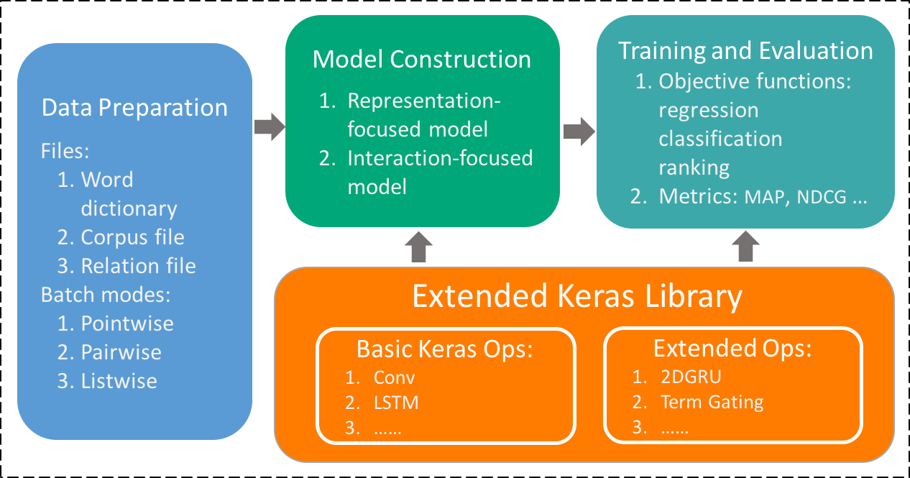

# MatchZoo
MatchingZoom is a toolkit for text matching. It was developed with a focus on enabling fast experimentation.

## Overview
The architecture of the MatchZoo toolit is depicited in . There are three major modules in the toolkit, namely data preparation, model construction, training and evaluation, respectively. These three modules are actually organized as a pipeline of data flow.

### Data Preparation
The data preparation module aims to convert dataset of different text matching tasks into a unified format as the input of deep matching models. Users provide datasets which contains pairs of texts along with their labels, and the module produces the following files.
* Word Dictionary
* Corpus File
* Relation File

### Model Construction
In the model construction module, we employ Keras libarary to help users build the deep matching model layer by layer conveniently.  e Keras libarary provides a set of common layers widely used in neural models, such as convolutional layer, pooling layer, dense layer and so on. To further facilitate the construction of deep text matching models, we extend the Keras libarary to provide some layer interfaces speci cally designed for text matching. 

### Training and Evaluation
For learning the deep matching models, the toolkit provides a variety of objective functions for regression, classification and ranking. For example, the ranking-related objective functions include several well-known pointwise, pairwise and listwise losses. It is flexible for users to pick up di erent objective functions in the training phase for optimization. Once a model has been trained, the toolkit could be used to produce a matching score, predict a matching label, or rank target texts (e.g., a document) against an input text.
Acknowledgements
=====
The following people contributed to the development of the TextNet project：

- **Yixing Fan**
    - Institute of Computing Technolgy, Chinese Academy of Sciences
    - [Google Scholar](https://scholar.google.com/citations?user=w5kGcUsAAAAJ&hl=en)
- **Liang Pang** 
    - Institute of Computing Technolgy, Chinese Academy of Sciences
    - [Google Scholar](https://scholar.google.com/citations?user=1dgQHBkAAAAJ&hl=zh-CN)
- **Jiafeng Guo**
    - Institute of Computing Technolgy, Chinese Academy of Sciences
    - [HomePage](http://www.bigdatalab.ac.cn/~gjf/)
- **Yanyan Lan**
    - Institute of Computing Technolgy, Chinese Academy of Sciences
    - [HomePage](http://www.bigdatalab.ac.cn/~lanyanyan/)
- **Jun Xu**
    - Institute of Computing Technolgy, Chinese Academy of Sciences
    - [HomePage](http://www.bigdatalab.ac.cn/~junxu/)
- **Xueqi Cheng**
    - Institute of Computing Technolgy, Chinese Academy of Sciences 
    - [HomePage](http://www.bigdatalab.ac.cn/~cxq/)
